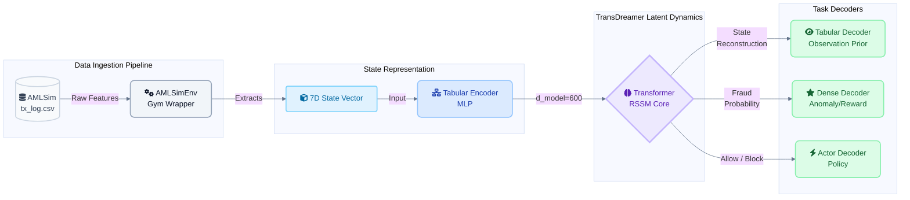
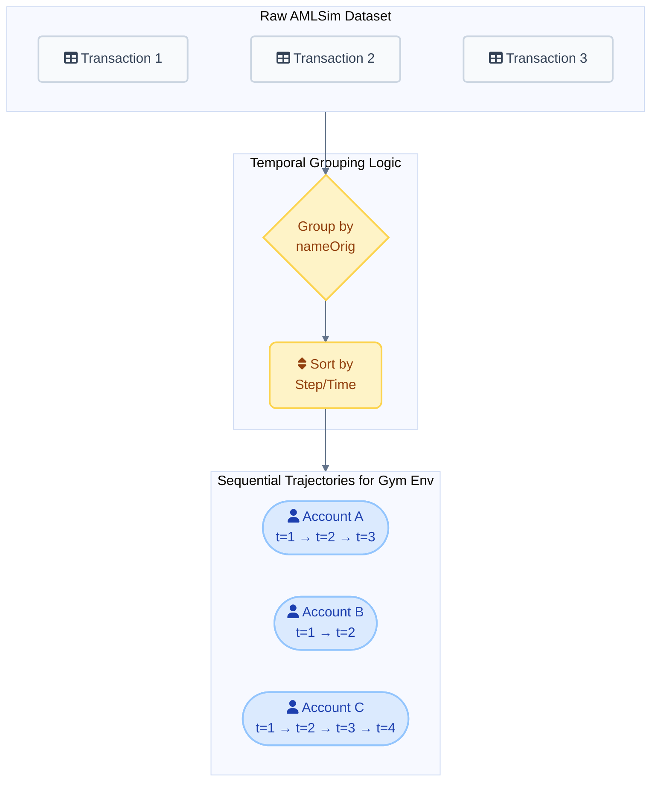

# TransDreamer-AMLSim Baseline

This repository adapts **[TransDreamer](https://github.com/danijar/dreamerv2)**—a Transformer-based Reinforcement Learning World Model originally designed for image-based environments like Atari—to process **tabular financial transaction data** using the AMLSim dataset.

## 🚀 What We Did & Architecture



TransDreamer natively expects 3D image tensors `(C, H, W)` and relies heavily on Convolutional Neural Networks (CNNs). To run it on tabular fraud data, we performed a "brain transplant" on the architecture:

1. **Custom Gym Environment (`envs/amlsim_env.py`)**:
   - Ingests AMLSim data and groups it by `nameOrig` to form transaction "trajectories" with long temporal horizons.
   - **State Space**: 7-dimensional tabular features (step, type, amount, old/new balances).
   - **Action Space**: Binary (0 = Allow, 1 = Block).
   - **Reward Logic**: `+1` for correct classification of `isSAR`, `-1` for incorrect.

2. **Tabular Encoders & Decoders (`model/modules_transformer.py`)**:
   - Bypassed the original `ImgEncoder` and `ImgDecoder`.
   - Built custom `TabularEncoder` and `TabularDecoder` MLPs capable of ingesting 1D tabular arrays and projecting them into the `d_model` dimensions required by the Transformer.

3. **Inference Pipeline (`evaluate_fraud.py`)**:
   - A custom evaluation script that loads trained checkpoints, feeds unseen sequences of account history, and predicts the "novel future state" to manually evaluate if the model is learning the structure of banking behavior over time.

### Temporal Trajectory Construction
To adapt static tabular logs for a Reinforcement Learning World Model, we fundamentally restructure the data into temporal sequences:



## 🔬 Experimental Findings

We trained this baseline on a Cloud GPU for 30,000 steps. Using the custom inference script (`evaluate_fraud.py`), we evaluated the model against unseen accounts and discovered two critical insights:

### 1. The Normalization Quirk
AMLSim's raw tabular features are currently being inadvertently scaled using TransDreamer's original Atari pixel normalization (`obs / 255.0 - 0.5`) before entering the `TabularEncoder`. Because our features are large monetary values rather than 0-255 pixels, this produces unusually large loss numbers. This quirk does not stop the model from learning (proving the robustness of the latent space), but fixing this should be prioritized in future architecture refinements.

### 2. Missing Arithmetic Constraints
When the model predicts future states, it predicts the transaction `Amount`, `Old Balance`, and `New Balance`. In reality, these should satisfy the equation `Old + Amount = New`. 

However, we found that the model's predictions **consistently violate this arithmetic by roughly $8 to $12** across all unseen accounts. 

**Why?** The architecture's `TabularDecoder` models each of these 7 tabular features as completely independent Gaussian distributions (`Independent(Normal(...))`). There is no structural joint constraint forcing them to align algebraically. The model must learn this arithmetic purely from data. 

#### Inference & Evaluation Flow
```mermaid
%%{init: {'theme': 'base', 'themeVariables': { 'fontFamily': 'Inter, sans-serif', 'lineColor': '#64748b' }}}%%
sequenceDiagram
    autonumber
    participant Env as AMLSimEnv (Ground Truth)
    participant Model as TransDreamer (Latent State)
    participant Dec as Tabular Decoder (Independent Heads)
    
    Env->>Model: Feed History (t=1 to 10)
    Note over Model: Build Temporal Context
    Model->>Dec: Combined Latent State (RNN + Prior)
    
    rect rgb(241, 245, 249)
        Note right of Dec: Independent Gaussian Decoding
        Dec-->>Dec: Head 1: Amount Prediction
        Dec-->>Dec: Head 2: Old Balance Prediction
        Dec-->>Dec: Head 3: New Balance Prediction
    end
    
    Dec->>Env: Predicted Novel State (t=11)
    
    Note over Env,Dec: Arithmetic Evaluation Metric: <br> | (Old Balance + Amount) - New Balance | &ne; 0
```

**Conclusion:** Tracking the arithmetic error (`|Old + Amount - New|`) is a highly effective, novel metric to evaluate how well a World Model is learning the latent "rules" of a tabular environment, far beyond what standard loss curves can show.

## ⚙️ How to Run Evaluation

```bash
python evaluate_fraud.py model_000029001.pth
```